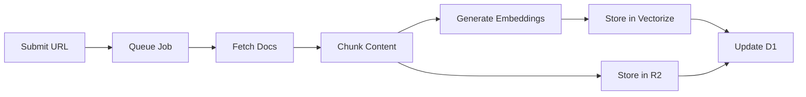

import { Card, CardGrid } from '@astrojs/starlight/components';

## The Problem with Raw Context

Traditional approaches to providing documentation to AI assistants involve:

1. **Context Stuffing** - Dumping entire documentation files into the prompt
2. **Real-time Fetching** - Scraping docs on-demand for each query
3. **RAG Pipelines** - Running similarity search in real-time

All of these approaches have significant downsides:

| Approach | Issues |
|----------|--------|
| Context Stuffing | Uses 100k-500k tokens per query, expensive and slow |
| Real-time Fetching | 2-10+ second latency, rate limits, unreliable |
| RAG Pipelines | Requires infrastructure, embedding costs per query |

## Nexus Architecture

Nexus solves these problems with a **pre-indexed semantic search** architecture:

<CardGrid>
  <Card title="1. Pre-Processing" icon="document">
    Documentation is crawled and chunked **ahead of time**, not during queries.
  </Card>
  <Card title="2. Vector Embeddings" icon="setting">
    Each chunk is embedded using Cloudflare AI (`bge-base-en-v1.5`) and stored in Vectorize.
  </Card>
  <Card title="3. Edge Storage" icon="rocket">
    Content is stored in R2, metadata in D1 - all on Cloudflare's edge network.
  </Card>
  <Card title="4. Semantic Search" icon="magnifier">
    Queries are embedded once and matched against pre-computed vectors in ~50ms.
  </Card>
</CardGrid>

## Token Savings

The key insight is that **you don't need the entire documentation** - you just need the relevant chunks.

### Before Nexus (Context Stuffing)

```
Full React documentation: ~450,000 tokens
Full Next.js documentation: ~380,000 tokens
Full Hono documentation: ~85,000 tokens
---
Total for 3 libraries: ~915,000 tokens
```

### With Nexus (Semantic Search)

```
Query: "How to use React hooks with TypeScript"
Relevant chunks: 5 chunks × ~500 tokens = 2,500 tokens
---
Token savings: 99.7%
```

### Response Formats

Nexus offers 4 response formats to further control token usage:

| Format | Description | Typical Tokens |
|--------|-------------|----------------|
| `full` | Complete documentation with all metadata | ~5,000 |
| `compact` | Essential data only, minimal formatting | ~2,000 |
| `code-only` | Just the code blocks and essential context | ~1,000 |
| `summary` | Brief overview with key points | ~500 |

## Infrastructure

Nexus runs entirely on Cloudflare's edge network:

```
┌─────────────────┐     ┌─────────────────┐     ┌─────────────────┐
│   MCP Client    │────▶│   Workers API   │────▶│   Vectorize     │
│ (Claude, Cursor)│     │   (Hono)        │     │   (Embeddings)  │
└─────────────────┘     └─────────────────┘     └─────────────────┘
                               │                        │
                               ▼                        │
                        ┌─────────────────┐            │
                        │      D1         │◀───────────┘
                        │   (Metadata)    │
                        └─────────────────┘
                               │
                               ▼
                        ┌─────────────────┐
                        │      R2         │
                        │   (Content)     │
                        └─────────────────┘
```

### Components

| Service | Purpose |
|---------|---------|
| **Workers** | API endpoints, MCP protocol handling |
| **D1** | SQLite database for metadata, library info |
| **R2** | Object storage for documentation chunks |
| **Vectorize** | Vector database for semantic embeddings |
| **AI** | Text embedding generation |
| **KV** | Session management, caching |

## Indexing Pipeline

Documentation is indexed through an async pipeline:

1. **Submission** - Library URL submitted via web UI or API
2. **Crawling** - Workers fetch documentation from GitHub/web
3. **Chunking** - Content split into semantic chunks (~500 tokens each)
4. **Embedding** - Each chunk embedded via Cloudflare AI
5. **Storage** - Chunks stored in R2, embeddings in Vectorize, metadata in D1



## Query Flow

When you ask a question:

1. **Embed Query** - Your question is embedded using the same model
2. **Vector Search** - Find the top-k most similar chunks
3. **Fetch Content** - Retrieve chunk content from R2
4. **Format Response** - Apply the requested format (full/compact/code-only/summary)
5. **Return** - Send formatted documentation to the AI assistant

Average query latency: **~50ms**

## Memory Architecture

Memories use the same infrastructure but with user-scoped storage:

- **User Memories** - Private, tied to your account
- **Global Memories** - Shared project context
- **Vector Search** - Same semantic search for recall
- **Expiration** - Optional TTL for temporary context

## Cost Efficiency

By pre-indexing and using edge infrastructure:

| Metric | Value |
|--------|-------|
| Embedding cost per query | $0 (pre-computed) |
| Average query latency | ~50ms |
| Storage per 1M tokens | ~$0.015/month |
| Queries per dollar | ~100,000 |

This is why Nexus can offer a generous free tier (2,000 queries/month) while remaining sustainable.
